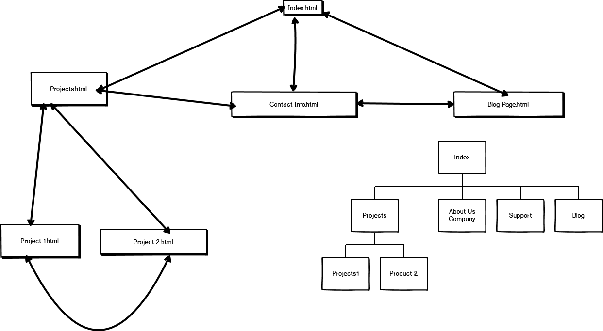

# AnthonyWilde_T1A3

Welcome to my portfolio, please stay awhile and listen. There will be refreshments and finger food served momentarily. 

Website - https://anthonywilde1.github.io/AnthonyWilde_T1A3/

Repository - https://github.com/Anthonywilde1/AnthonyWilde_T1A3

Purpose - The purpose of this website was to demonstrate my skills in HTML and CSS while also completing an assessment for CoderAcademy, 

Functionality/features - My sites includes capabilities for phones, tablets and computers. The site has a header/ nav bar that will scroll throughout the page with you which is useful for navigating the pages quickly on any device.  The portfolio has an introduction page with a picture of me on it, a contact page with 4 links (each one to a separate page), a Blog page (the blogs aren't actual blogs just place holder items) and a page listening my previous projects. I also had a link that downloads my resume. A common feature throughout the code was to add hyperlinks that were embedded into photos, i think in total there is 5-6 times a picture links to a different website. I also made a nice hotpink scroll bar for desktop, you should feel special for viewing my site on desktop. Another feature i am proud of is you can get from one page to any other page at any time with the nav bar at the top or bottom. Different branches of my website features other features like Titles that zoom in, nav bars on the side of the page and a different colour theme.

Sitemap - The Site Map for this portfolio can be viewed inside of the SRC file and the slide deck file inside of that, under a png called site map (only do this if the pictures isnt right here).

Screenshots - 

Target audience - My target audience for this is adults of any ages/maturity, I think it creates a nice blend of formal/silliness, blending the two together. 

Tech stack (css, html, deployment etc) - The portfolio was created using my CSS and HTML skills, everything on the site is made using these 2 languages exclusively. I uploaded the work to GitHub to then have it deploy my website for everyone's viewing pleasure. 